# StoreFlow Frontend Audit & Remediation

**Scope:** `web/` SPA (frontend only; backend delivered separately).
**Reviewer role:** senior frontend engineer · accessibility specialist · application security reviewer.
**Language:** en-GB. **Date:** 2026-07-03.
**Baseline:** 35 passing logic tests, **1 broken test file**, typecheck failing (see F-01).
**After remediation:** typecheck clean · lint clean · **60 unit/integration tests passing**.

---

## 1. Executive summary

StoreFlow's frontend is, on the whole, **well-architected** for a mock-backed SPA.
The authentication design is notably strong: the access token is held **in memory
only** (never `localStorage`/`sessionStorage`), refresh runs through a
single-flight helper shared by a proactive scheduler and a reactive 401
interceptor, and route guards wait for the initial silent refresh before
deciding. There are **no `dangerouslySetInnerHTML` sinks**, no `eval`, and no
tokens in web storage. That means there were **no Critical XSS or auth-storage
defects** in frontend-controlled code paths — the acceptance bar for "no Critical
security defects" was already close to met and is now met.

The real problems were concentrated in three areas:

1. **A broken test/typecheck pipeline** (`@testing-library/dom` missing) — CI
   could not enforce anything on components. This is the single highest-leverage
   fix: it unblocks every other guarantee.
2. **Accessibility defects in shared primitives** used on every screen — the
   `Input` label was not programmatically associated, the `Modal` had no focus
   trap/return, and the `Toast` rendered a green success tick for **all**
   messages including errors. Because these are shared components, each fix
   propagates across the whole app.
3. **Inconsistent validation & defensive gaps** — the product form bypassed the
   project's stated zod pattern with ad-hoc checks and no double-submit guard;
   user-supplied image URLs were rendered without scheme validation; the HTTP
   layer collapsed 403/429/5xx/timeout into a generic "Network error" with no
   `Retry-After` handling and no request timeout; and there was no CSP, no
   dependency scanning, and no CI.

All of the above have been fixed or documented. Remaining items (self-hosting
fonts, migrating inline styles off `'unsafe-inline'`, converting all forms to the
shared primitives, upgrading the dev-only vulnerable `vite`/`vitest` chain) are
tracked with severity and effort in §4 and the CSV.

## 2. Environment and discovered stack

| Area | Finding |
|---|---|
| Framework | React **18.3** + Vite 5 + TypeScript 5.5 (strict) |
| Routing | react-router-dom 6 (`BrowserRouter`, nested routes, guards) |
| State | Zustand 4 (session + feature stores); TanStack Query 5 (wired, mock data today) |
| Forms | react-hook-form 7 + zod 4 (`@hookform/resolvers`) — used on auth; **not** on product form (fixed) |
| HTTP | axios 1 with request/response interceptors (`src/lib/axios.ts`) |
| Auth | Mock `authService`; in-memory access token + HttpOnly-cookie refresh pattern; RBAC via `src/lib/rbac.ts` + `guards.tsx` |
| Tests | Vitest 2 + Testing Library + jsdom; **`@testing-library/dom` peer was missing** |
| Lint | ESLint 9 flat config + typescript-eslint; webhint `.hintrc` (not in CI) |
| Bundler/deploy | Vite build; deploy target **UNSPECIFIED** |

Routes inventoried: public `login/register/reset/403`; store `dashboard, pos,
sales, sales/:id/receipt, products, categories, inventory, customers,
customers/:id, suppliers, purchase-orders, reports, employees, settings`;
platform-admin `overview, stores, approvals, users, plans, security, audit,
settings`. Forms: login, register, reset, product, category, customer,
employee, PO, store/system settings. Tables via shared `DataTable`. Overlays via
shared `Modal` + `confirmDialog` (native `window.confirm`). Rich text / file
upload: **none found** (product "image" is a URL field, not an upload).

## 3. Missing inputs (UNSPECIFIED)

| Input | Status | Action taken |
|---|---|---|
| Production API origin | UNSPECIFIED | `connect-src`/CSP use `API_ORIGIN` placeholder; env is `VITE_API_BASE_URL` |
| Deployment target (CDN/host) | UNSPECIFIED | Shipped `public/_headers` (Netlify/CF) **and** nginx snippet |
| Device/browser support matrix | UNSPECIFIED | Adopted fallback matrix: iOS Safari, Android Chrome, desktop Chrome/Firefox/Edge/Safari, latest−1; breakpoints 360/768/1024/1280. Playwright runs Desktop Chrome + Pixel 7 |
| Design system / component library | None (bespoke inline-styled primitives) | Kept convention; hardened primitives in place |
| Backend cookie/CSRF policy | UNSPECIFIED | Documented required `HttpOnly; Secure; SameSite` + CSRF in `docs/security-headers.md` |
| WCAG target | Assumed **2.2 AA** per brief | Applied |

## 4. Prioritised issue list

Severity = impact; Effort in T-shirt size + person-days (PD). Sorted impact-first.
Status: ✅ fixed in this pass · 📝 documented/guidance · ⏳ recommended follow-up.

| ID | Severity | Effort | Issue | Impacted files | Status |
|---|---|---|---|---|---|
| F-01 | **High** | XS · 0.25 | `@testing-library/dom` peer missing → `ui.test.tsx` fails to load, `screen` import breaks **typecheck**; component CI unenforceable | `package.json` | ✅ |
| F-02 | **High** | S · 0.5 | `Input` label not associated (no `htmlFor`/`id`); error not linked via `aria-describedby`. Fails WCAG 1.3.1/3.3.2/4.1.2 on **every form** | `components/ui/Input.tsx` | ✅ |
| F-03 | **High** | M · 1 | `Modal` has no focus trap, no focus-move-in, no focus-return, `<h3>` heading jump, no scroll lock. Keyboard/SR users can leave the dialog. WCAG 2.4.3/2.1.2/4.1.2 | `components/ui/Modal.tsx` | ✅ |
| F-04 | **High** | S · 0.5 | Product image URL rendered in `` without scheme validation (`javascript:`/`data:` accepted from input) | `lib/security/url.ts`, `products/ProductForm.tsx`, `lib/validation/product.ts` | ✅ |
| F-05 | **High** | S · 0.5 | No CSP, no HSTS/nosniff/Referrer/Permissions-Policy; Google Fonts via CDN w/o self-host | `public/_headers`, `index.html`, `docs/security-headers.md` | ✅/📝 |
| F-06 | **Medium** | M · 1 | Product form bypasses zod: ad-hoc `toast()` checks, no per-field errors, **no double-submit guard** | `products/ProductForm.tsx`, `lib/validation/product.ts` | ✅ |
| F-07 | **Medium** | S · 0.5 | HTTP errors collapse 403/429/5xx/timeout → generic "Network error"; **no request timeout**; no `Retry-After` | `lib/axios.ts`, `lib/http/errors.ts` | ✅ |
| F-08 | **Medium** | S · 0.5 | `Toast`: hard-coded green ✓ for **all** messages (incl. errors); single `role=status` polite region → errors not announced assertively; no manual dismiss (WCAG 1.4.1 colour-only, 4.1.3, 2.2.1) | `components/ui/Toast.tsx` | ✅ |
| F-09 | **Medium** | XS · 0.25 | `DataTable` headers lack `scope="col"`, no `aria-busy`, no caption/name | `components/ui/DataTable.tsx` | ✅ |
| F-10 | **Medium** | S · 0.5 | `SearchCombobox` missing `aria-controls`/`aria-activedescendant`/`aria-autocomplete`/option ids/label → SR cannot follow active option (WCAG 4.1.2) | `components/ui/SearchCombobox.tsx` | ✅ |
| F-11 | **Medium** | S · 0.5 | No dependency scanning / CI; dev deps had **high/critical** advisories (`vite`/`vitest`/`esbuild`). Upgraded to **vite 8 / vitest 4 / plugin-react 5** → `npm audit` now **0 vulnerabilities**; CI + Dependabot added | `.github/workflows/ci.yml`, `.github/dependabot.yml`, `package.json`, `vite.config.ts` | ✅ |
| F-12 | **Low** | XS · 0.1 | `@eslint/js@^10` mismatched with `eslint@^9` → install needs `--legacy-peer-deps` | `package.json` | ✅ |
| F-13 | **Low** | XS · 0.1 | `Button` loading state not exposed as `aria-busy`; label replaced by "Please wait…" | `components/ui/Button.tsx` | ✅ |
| F-14 | **Medium** | M · 1 | `confirmDialog` uses native `window.confirm` — unstyled, not themeable, blocks event loop; used for destructive actions | `components/ui/Modal.tsx` | ⏳ |
| F-15 | **Medium** | L · 3 | Inline styles everywhere force CSP `style-src 'unsafe-inline'`; blocks strict CSP | app-wide | ⏳ |
| F-16 | **Low** | M · 1 | Self-host Google Fonts to drop third-party CDN + tighten `font-src`/`style-src` | `index.html`, `public/fonts` | ⏳ |
| F-17 | **Medium** | L · 2 | Roll the hardened `Input`/zod pattern across all remaining forms (customer, employee, category, settings) | `features/**` | ⏳ |
| F-18 | **Low** | S · 0.5 | Reauthentication/step-up for sensitive actions (role edits, security settings) not enforced client-side | `features/admin/**`, `lib/rbac.ts` | ⏳ 📝 |

**Positive findings (no action):** in-memory token (never in storage) ✅;
single-flight refresh ✅; guards await `status==='loading'` ✅; no
`dangerouslySetInnerHTML`/`eval` ✅; `prefers-reduced-motion` honoured ✅;
`:focus-visible` ring present globally ✅; print-scoped receipt ✅.

## 5. Implemented fixes (snippets + paths)

### F-01 Test/typecheck pipeline unblocked — `package.json`
Added `@testing-library/dom@^10.4.1` (peer of `@testing-library/react`). `screen`
now imports, `ui.test.tsx` loads, typecheck passes.

### F-02 Accessible `Input` — `src/components/ui/Input.tsx`
```tsx
const inputId = id ?? `in-${useId()}`;
const describedBy = [describedByProp, hint && hintId, error && errorId].filter(Boolean).join(' ') || undefined;
<label htmlFor={inputId}>{label}</label>
<input id={inputId} aria-invalid={error ? true : undefined} aria-describedby={describedBy} … />
{error && <div id={errorId} role="alert">{error}</div>}
```

### F-03 Focus-managed `Modal` — `src/components/ui/Modal.tsx`
Focus moves to the first focusable on open, `Tab`/`Shift+Tab` are trapped,
focus is restored to the opener on close, `aria-labelledby` points at the
title (now `<h2>`), body scroll is locked. `Escape` handling retained.

### F-04 / F-06 Safe image URLs + zod product validation
`src/lib/security/url.ts` → `safeImageUrl()` rejects `javascript:`/`data:`/
`vbscript:`/`file:` and control-char smuggling. `src/lib/validation/product.ts`
runs the URL through the guard as a zod `.transform`, so the persisted/rendered
value can never be a script URL. `ProductForm` now uses `productSchema.safeParse`,
maps issues to per-field `error` props, and guards against double submit:
```tsx
const submit = () => {
  if (submitting) return;                       // anti double-submit
  const parsed = productSchema.safeParse(form);  // centralised zod
  if (!parsed.success) { /* map issues -> field errors */ return; }
  setSubmitting(true); try { …create/update using parsed.data… } finally { setSubmitting(false); }
};
```

### F-07 Normalised HTTP errors — `src/lib/axios.ts` + `src/lib/http/errors.ts`
`timeout: 15_000`; typed `ApiError` with `status`, `code`
(`TIMEOUT|UNAUTHENTICATED|FORBIDDEN|RATE_LIMITED|SERVER|NETWORK`), parsed
`Retry-After` (delta-seconds **and** HTTP-date), and **user-safe messages** that
never reflect raw 5xx bodies. The single-flight 401→refresh→replay path is
preserved.

### F-08 Accessible `Toast` — `src/components/ui/Toast.tsx`
`success|error|info` variants with distinct colour **and** icon (not colour
alone); errors render in an `aria-live="assertive"` `role="alert"` region,
others in a polite `role="status"` region; every toast has a 24×24 dismiss
button; errors persist 8s vs 5s.

### F-09/F-10/F-13 Primitive a11y
`DataTable`: `scope="col"`, `aria-busy`, hidden `<caption>`.
`SearchCombobox`: `aria-controls`, `aria-autocomplete="list"`,
`aria-activedescendant`, option `id`s, accessible name.
`Button`: `aria-busy` while loading.

### F-05/F-11/F-12 Platform hardening
`index.html` gains a `referrer` meta + CSP pointer comment; `public/_headers`
ships the full header set; `docs/security-headers.md` documents CSP, SRI stance,
and backend cookie/CSRF requirements. `.github/workflows/ci.yml`
(typecheck·lint·unit·audit·e2e) + `.github/dependabot.yml` added.
`@eslint/js` pinned to `^9.39.0` to match ESLint 9.

## 6. Accessibility remediation plan

**Done:** label association + `aria-describedby`/`aria-invalid` (Input); dialog
semantics, focus trap & return (Modal); assertive/polite live regions +
non-colour status cues + dismiss (Toast); table header scope + busy state;
combobox ARIA 1.2 pattern; button busy state; target-size ≥24px on icon
controls. Global `:focus-visible` ring and `prefers-reduced-motion` already
present.

**Automated checks:** `e2e/auth.spec.ts` runs `@axe-core/playwright` with
`wcag2a/aa`, `wcag21`, `wcag22aa` tags and fails on any serious/critical
violation on the login flow. Extend the axe sweep to dashboard, POS, and a
data-table page next.

**Manual review still owed (follow-up F-17):** roll the shared `Input`/`select`
labelling across customer/employee/category/settings forms; verify heading order
per page (single `<h1>` per view — several pages start at `<h2>`); confirm
contrast of `--ink-faint (#94a3b8)` on `--paper` for **body** text (≈2.9:1 — OK
for large/decorative, **fails** AA for normal text; restrict its use to
non-essential text or darken to `#64748b`); add a "skip to main content" link in
`AppShell`; label the mobile drawer as a dialog with focus trapping.

## 7. Security remediation plan

- **XSS:** no HTML sinks today; keep it that way. If user HTML is ever rendered,
  route it through DOMPurify (add `dompurify` + `@types/dompurify`) — documented
  as the only approved path. Image URLs are now scheme-validated.
- **Auth/session:** keep the in-memory-token + HttpOnly-refresh model. Backend
  must set `HttpOnly; Secure; SameSite=Lax`, rotate refresh tokens with reuse
  detection, and add CSRF protection on cookie-authenticated mutations
  (see `docs/security-headers.md`). Add client **step-up reauth** for role edits
  and security settings (F-18).
- **Transport/headers:** deploy the CSP + header set from `public/_headers`/
  `docs/security-headers.md`; ship CSP report-only first.
- **Rate limiting:** client now honours `Retry-After` and blocks double-submit —
  **real rate limiting is server-side** and must not be relied on from the client.
- **Dependencies:** the dev-only high/critical advisories (`vite`/`vitest`/
  `esbuild`) have been cleared by upgrading to **vite 8 / vitest 4 /
  @vitejs/plugin-react 5** — `npm audit` reports **0 vulnerabilities**, and
  typecheck/lint/tests/build/dev-server all pass on the new majors. Dependabot +
  `npm audit` (prod deps) are wired in CI to keep it that way.
- **IDE noise:** `web/.hintrc` disables the webhint HTML a11y hints that misfire
  on JSX (e.g. `aria-busy={isLoading}` read as an invalid literal). webhint is
  not in the CI path; runtime a11y is validated by axe-core in the Playwright
  suite instead.
- **Uploads:** none exist yet. When added, validate type/size/count client-side
  and re-validate server-side (magic-byte sniffing, size caps, AV scan).

## 8. Test plan and artefacts

**Unit/integration (Vitest + Testing Library) — added:**
- `src/test/security-url.test.ts` — scheme/control-char rejection.
- `src/test/http-errors.test.ts` — `messageForStatus`, `parseRetryAfter`.
- `src/test/product-validation.test.ts` — zod rules + image sanitisation.
- `src/test/components.test.tsx` — Input labelling/`aria-describedby`, password
  toggle, Button `aria-busy`, Modal name/focus-trap/return, Toast live regions.

Result: **60 passing** (was 35 + 1 broken suite). `npm run typecheck` and
`npm run lint` are clean.

**E2E + a11y (Playwright + axe) — added** `e2e/auth.spec.ts`: axe smoke on
`/login`, inline error alert on bad login, owner sign-in → `/dashboard`,
protected-route → `/login?returnTo=…`. Runs on Desktop Chrome + Pixel 7.

**Commands**
```bash
cd web
npm ci
npm run typecheck && npm run lint && npm run test   # gate
npm run test:e2e                                    # needs: npx playwright install --with-deps
npm run audit:ci                                    # prod-dep vuln gate (high+)
npm audit                                           # full (incl. dev) report
```

## 9. Migration & rollout plan

Ship in small, independently revertible PRs (order = impact):

```mermaid
gantt
    title Rollout
    dateFormat X
    axisFormat %s
    section Enablers
    F-01 test/typecheck fix      :done, 0, 1
    F-12 eslint pin              :done, 0, 1
    F-11 CI + Dependabot         :done, 0, 1
    section A11y primitives
    F-02 Input                   :active, 1, 2
    F-03 Modal                   :active, 1, 2
    F-08 Toast                   :active, 1, 2
    F-09/F-10/F-13 primitives    :active, 1, 2
    section Security/validation
    F-04/F-06 URL+zod            :2, 3
    F-07 HTTP errors             :2, 3
    F-05 headers/CSP (report-only first) :3, 4
    section Follow-ups
    F-14 styled confirm          :4, 6
    F-16 self-host fonts         :4, 6
    F-15 CSP nonce / de-inline   :5, 8
    F-17 forms rollout           :5, 8
    F-18 step-up reauth          :5, 7
```



Behaviour changes to note in the changelog: product form now shows per-field
errors and blocks a second submit; invalid product image URLs silently become
empty (emoji fallback); toasts have a close button and errors are red; API
errors surface specific messages for 403/429/5xx/timeout.

## 10. Risks and rollback

| Change | Risk | Rollback |
|---|---|---|
| Modal focus trap | Rare nested-portal focus edge cases | Revert `Modal.tsx`; primitives are isolated |
| `safeImageUrl` transform | A legitimately-weird existing image URL becomes empty (emoji shown) — no crash | Widen allow-list or revert transform in `product.ts` |
| HTTP timeout 15s | Very slow legit calls abort | Bump `timeout` in `axios.ts` |
| CSP enforcement | Blocks an un-inventoried asset | Deploy **report-only** first; enforce after clean reports |
| `@eslint/js` `^9` pin | None expected (same flat-config API) | Restore `^10` + `--legacy-peer-deps` |
| Dev-dep `npm audit` gate | Not gating prod build (uses `--omit=dev`) | n/a — chosen to avoid noise |

## 11. Open questions

1. Production **API origin** and **deploy host**? (drives CSP `connect-src` and
   header delivery mechanism).
2. Confirmed **device/browser support matrix**? (currently a documented fallback).
3. Is a **CSRF token** issued by the backend, and via which header/cookie? (needed
   to finish cookie-session hardening).
4. Should destructive/admin actions require **step-up reauthentication**, and with
   what factor? (F-18).
5. OK to **self-host fonts** and **de-inline styles** to reach a strict, nonce-based
   CSP? (F-15/F-16).
6. Timeline for the real API — should stores migrate to TanStack Query hooks now,
   or stay mock-backed until integration?
```
